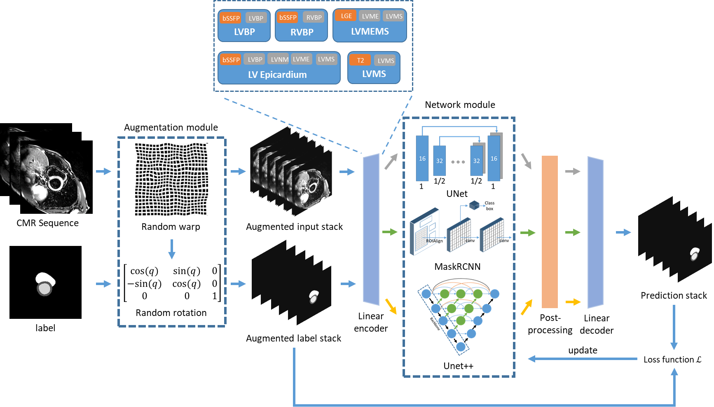

# MyoPS 2020: Fully Automated Deep Learning-based Segmentation of Normal, Infarcted and Edema Regions from Multiple Cardiac MRI Sequences
## [[Paper]](https://link.springer.com/chapter/10.1007/978-3-030-65651-5_8) [[Challenge website]](https://zmiclab.github.io/projects/myops20/)

## Overview


## Bibtex
```
@inproceedings{zhang2020fully,
  title={Fully automated deep learning based segmentation of normal, infarcted and edema regions from multiple cardiac MRI sequences},
  author={Zhang, Xiaoran and Noga, Michelle and Punithakumar, Kumaradevan},
  booktitle={Myocardial Pathology Segmentation Combining Multi-Sequence CMR Challenge},
  pages={82--91},
  year={2020},
  organization={Springer}
}
```
## Dataset
Please refer to challenge website [[link]](https://zmiclab.github.io/projects/myops20/) for dataset access.

## Environment
1. UNet: 

2. Mask-RCNN and UNet++:

## Default files


## Setup
1. Preprocessing
    - Extract dataset to 2D slices
    ```
    python data_creator.py
    ```
    
2. Train networks
    - Train UNet for
    - Train Mask-RCNN
        - Download mrcnn_coco.h5 
        - 
    - Train UNet++ for 

3. Test networks:
    - Test UNet
    - Test Mask-RCNN
    - Test UNet++ 

4. Post-processing and linear decoder:
    - Post processing
    ```
    python post_processing.py
    ```

## Acknowledgement
1. Please cite the official Mask-RCNN and UNet++ implementations if you use them:
    - Mask-RCNN: https://github.com/matterport/Mask_RCNN
    - UNet++: https://github.com/MrGiovanni/UNetPlusPlus
2. The authors would wish to acknowledge Compute Canada for providing the computation resource.